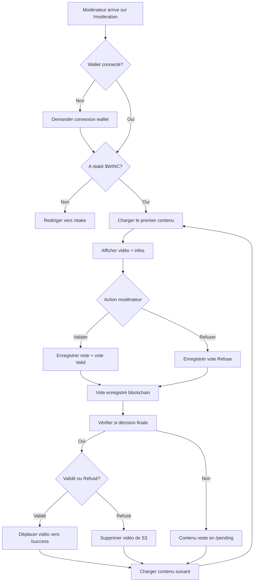

# 🎯 Structure de la page /moderation

## 📐 Architecture de l'interface

```
/moderation
├── Onglet "Initial Story"
│   ├── Sous-onglet "B2C & Agencies" (🔔 notifications)
│   └── Sous-onglet "Individual Creators" (🔔 notifications)
│
└── Onglet "Completion"
    ├── Sous-onglet "For B2C" (🔔 notifications)
    └── Sous-onglet "For Individuals" (🔔 notifications)
```

### Comportement UX

- **Un seul contenu à l'écran** à la fois (pas de liste)
- **Notifications** sur chaque onglet/sous-onglet indiquant le nombre de contenus à modérer
- **Flux continu** : Après validation/refus, le contenu suivant se charge automatiquement
- **Pas de retour arrière** : Un modérateur ne revoit jamais un contenu déjà modéré

---

## 🔐 Authentification & Accès

### Prérequis pour accéder à /moderation

```typescript
// Vérifications côté serveur ET client
const canModerate = {
  walletConnected: true,        // Wallet connecté
  hasWincStaked: true,           // A staké du $WINC
  stakedAmount: >= minStaking,   // Montant minimum (à paramétrer)
  isEligible: true               // Vérifié via blockchain
};

if (!canModerate.isEligible) {
  // Redirection ou message : "You need to stake $WINC to moderate"
  redirect('/stake');
}
```

### Barrière d'entrée

1. **Connexion wallet** obligatoire
2. **Vérification du staking $WINC** 
3. **Enregistrement blockchain** : Chaque vote est inscrit on-chain
4. **Vote non-éligible ignoré** : Si un utilisateur contourne l'UI, son vote ne compte pas

---

## 🎲 Algorithme de priorité d'affichage

```typescript
// Ordre de priorité pour déterminer quel contenu afficher
function getNextContentToModerate(moderatorWallet, category, subcategory) {
  
  // Exclure les contenus déjà modérés par ce wallet
  const notModeratedByUser = excludeAlreadyModerated(moderatorWallet);
  
  // 1️⃣ PRIORITÉ ABSOLUE : Campagnes initiales < 22 votes
  const blockingCampaigns = notModeratedByUser.filter(
    content => content.type === 'INITIAL' && content.totalVotes < 22
  ).sort((a, b) => a.totalVotes - b.totalVotes); // Les moins votées en premier
  
  if (blockingCampaigns.length > 0) {
    return blockingCampaigns[0];
  }
  
  // 2️⃣ PRIORITÉ HAUTE : Échéance < 24h
  const urgentCampaigns = notModeratedByUser.filter(
    content => content.deadline && (content.deadline - Date.now()) < 24 * 60 * 60 * 1000
  ).sort((a, b) => a.deadline - b.deadline); // Les plus urgentes en premier
  
  if (urgentCampaigns.length > 0) {
    return urgentCampaigns[0];
  }
  
  // 3️⃣ PRIORITÉ NORMALE : Semi-aléatoire pondéré par participation
  // Les campagnes avec moins de votes remontent plus souvent
  const remainingCampaigns = notModeratedByUser;
  
  // Calcul de poids inversé (moins de votes = plus de chances d'être sélectionné)
  const weighted = remainingCampaigns.map(content => ({
    content,
    weight: 1 / (content.totalVotes + 1) // +1 pour éviter division par 0
  }));
  
  // Sélection aléatoire pondérée
  const totalWeight = weighted.reduce((sum, item) => sum + item.weight, 0);
  let random = Math.random() * totalWeight;
  
  for (const item of weighted) {
    random -= item.weight;
    if (random <= 0) {
      return item.content;
    }
  }
  
  // Fallback (ne devrait jamais arriver)
  return remainingCampaigns[0];
}
```

---

## 📊 Informations affichées à l'écran

```typescript
interface ModerationDisplay {
  // Vidéo
  videoUrl: string;              // URL S3 de la vidéo en /pending
  videoOrientation: 'horizontal' | 'vertical';
  
  // Informations de la campagne
  title: string;
  startingStory: string;
  guidelines: string;
  creatorType: 'B2C' | 'AGENCY' | 'INDIVIDUAL';
  campaignId: string;
  
  // Statistiques de modération
  totalVotes: number;            // Ex: 2 / 22
  requiredVotes: number;         // 22 pour initial, autre pour completion
  validPercentage: number;       // Ex: 60% (Valid votes)
  refusePercentage: number;      // Ex: 40% (Refuse votes)
  
  // Conditions de validation
  conditions: {
    hasMinStaking: boolean;      // WINC staké > MINT Price ?
    hasRatio: boolean;           // Ratio 2:1 atteint ?
    hasMinVotes: boolean;        // Minimum de votes atteint ?
  };
  
  // Urgence
  deadline: Date | null;
  hoursRemaining: number | null;
  isPriority: boolean;           // Est-ce une campagne initiale bloquante ?
}
```

### Exemple d'affichage

```
┌─────────────────────────────────────────────────┐
│  🎬 Vidéo de la campagne                        │
│  [Lecteur vidéo ici]                            │
│                                                 │
│  📊 Votes: 12 / 22                              │
│  ✅ Valid: 75%  |  ❌ Refuse: 25%               │
│                                                 │
│  ⏰ Échéance: 18h restantes                     │
│  🔥 Priorité: Campagne initiale bloquante       │
│                                                 │
│  📋 Conditions de validation:                   │
│  ✅ WINC staké > MINT Price                     │
│  ✅ Ratio 2:1 atteint                           │
│  ⏳ Minimum 22 votes (12/22)                    │
│                                                 │
│  ━━━━━━━━━━━━━━━━━━━━━━━━━━━━━━━━━━━━━━━━━━━  │
│                                                 │
│  📝 Story: "In a world where..."                │
│  🎯 Guideline: "Focus on..."                    │
│                                                 │
│  [Noter: 1★ 2★ 3★ 4★ 5★ 6★ 7★ 8★ 9★ 10★]       │
│                                                 │
│  [❌ Refuser]           [✅ Valider avec note]  │
│                                                 │
└─────────────────────────────────────────────────┘
```

---

## 🔄 Flux de modération



---

## 🎨 Structure React de la page

```typescript
// /app/moderation/page.tsx
'use client';

import { useState, useEffect } from 'react';
import { useActiveAccount } from 'thirdweb/react';
import VideoPlayer from '@/components/moderation/VideoPlayer';
import ModerationStats from '@/components/moderation/ModerationStats';
import VotingInterface from '@/components/moderation/VotingInterface';

type Category = 'initial' | 'completion';
type Subcategory = 'b2c' | 'individual';

export default function ModerationPage() {
  const account = useActiveAccount();
  const [category, setCategory] = useState<Category>('initial');
  const [subcategory, setSubcategory] = useState<Subcategory>('b2c');
  const [currentContent, setCurrentContent] = useState(null);
  const [isEligible, setIsEligible] = useState(false);
  const [notifications, setNotifications] = useState({
    initialB2C: 0,
    initialIndividual: 0,
    completionB2C: 0,
    completionIndividual: 0
  });

  // Vérifier l'éligibilité du modérateur
  useEffect(() => {
    if (account?.address) {
      checkModeratorEligibility(account.address);
    }
  }, [account]);

  // Charger le premier contenu
  useEffect(() => {
    if (isEligible) {
      loadNextContent();
    }
  }, [isEligible, category, subcategory]);

  const checkModeratorEligibility = async (walletAddress: string) => {
    // TODO: Vérifier staking $WINC
    const response = await fetch('/api/moderation/check-eligibility', {
      method: 'POST',
      body: JSON.stringify({ walletAddress })
    });
    const { eligible } = await response.json();
    setIsEligible(eligible);
  };

  const loadNextContent = async () => {
    const response = await fetch('/api/moderation/next-content', {
      method: 'POST',
      body: JSON.stringify({
        moderatorWallet: account?.address,
        category,
        subcategory
      })
    });
    const content = await response.json();
    setCurrentContent(content);
  };

  const handleVote = async (decision: 'valid' | 'refuse', score?: number) => {
    // Enregistrer le vote
    await fetch('/api/moderation/vote', {
      method: 'POST',
      body: JSON.stringify({
        contentId: currentContent.id,
        moderatorWallet: account?.address,
        decision,
        score
      })
    });

    // Charger le contenu suivant
    loadNextContent();
  };

  if (!account) {
    return <ConnectWalletPrompt />;
  }

  if (!isEligible) {
    return <StakingRequiredPrompt />;
  }

  return (
    <div className="moderation-page">
      {/* Onglets */}
      <Tabs 
        category={category} 
        setCategory={setCategory}
        notifications={notifications}
      />
      
      {/* Sous-onglets */}
      <SubTabs 
        subcategory={subcategory}
        setSubcategory={setSubcategory}
        category={category}
        notifications={notifications}
      />

      {/* Contenu principal */}
      {currentContent ? (
        <>
          <VideoPlayer videoUrl={currentContent.videoUrl} />
          <ModerationStats stats={currentContent.stats} />
          <CampaignInfo info={currentContent} />
          <VotingInterface onVote={handleVote} />
        </>
      ) : (
        <NoContentAvailable />
      )}
    </div>
  );
}
```

---

## 🔧 APIs nécessaires

### 1. Vérifier l'éligibilité

```typescript
// /app/api/moderation/check-eligibility/route.ts
export async function POST(request: NextRequest) {
  const { walletAddress } = await request.json();
  
  // TODO: Vérifier le staking $WINC on-chain
  const hasStaked = await checkWincStaking(walletAddress);
  const stakedAmount = await getStakedAmount(walletAddress);
  const minRequired = 100; // À paramétrer
  
  return NextResponse.json({
    eligible: hasStaked && stakedAmount >= minRequired,
    stakedAmount,
    minRequired
  });
}
```

### 2. Récupérer le contenu suivant

```typescript
// /app/api/moderation/next-content/route.ts
export async function POST(request: NextRequest) {
  const { moderatorWallet, category, subcategory } = await request.json();
  
  // Appliquer l'algorithme de priorité
  const content = await getNextContentToModerate(
    moderatorWallet,
    category,
    subcategory
  );
  
  return NextResponse.json(content);
}
```

### 3. Enregistrer un vote

```typescript
// /app/api/moderation/vote/route.ts
export async function POST(request: NextRequest) {
  const { contentId, moderatorWallet, decision, score } = await request.json();
  
  // 1. Enregistrer le vote dans Supabase
  await supabase.from('moderation_votes').insert({
    content_id: contentId,
    moderator_wallet: moderatorWallet,
    decision,
    score: decision === 'valid' ? score : 0,
    voted_at: new Date().toISOString()
  });
  
  // 2. TODO: Enregistrer on-chain (blockchain)
  await recordVoteOnChain(contentId, moderatorWallet, decision, score);
  
  // 3. Vérifier si décision finale
  const isFinal = await checkFinalDecision(contentId);
  
  if (isFinal) {
    await handleFinalDecision(contentId);
  }
  
  return NextResponse.json({ success: true });
}
```

---

## 📋 TODO pour implémentation

- [ ] Créer la page `/app/moderation/page.tsx`
- [ ] Implémenter l'algorithme de priorité
- [ ] Créer API `/api/moderation/check-eligibility`
- [ ] Créer API `/api/moderation/next-content`
- [ ] Créer API `/api/moderation/vote`
- [ ] Ajouter table `moderation_votes` dans Supabase
- [ ] Créer composants React (VideoPlayer, VotingInterface, etc.)
- [ ] Intégrer vérification staking $WINC (à paramétrer ultérieurement)
- [ ] Implémenter enregistrement blockchain des votes
- [ ] Créer logique de décision finale (conditions de validation)
- [ ] Tester le flux complet

---

**Cette structure est prête à être implémentée ! 🚀**

