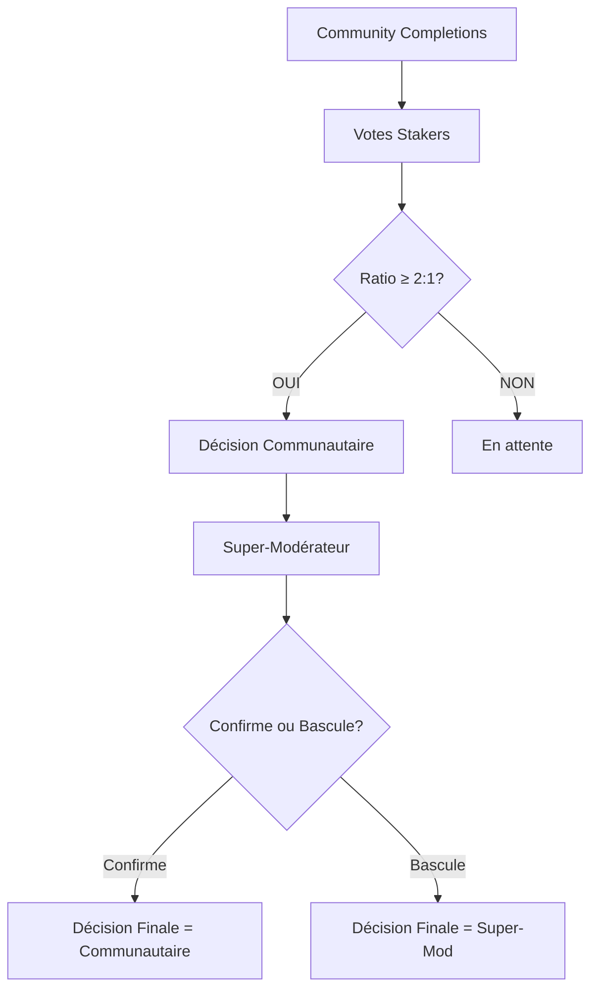

# 👑 SYSTÈME SUPER-MODÉRATEUR WINSTORY V.1

## 🎯 Vue d'ensemble

Le système Super-Modérateur permet aux créateurs de campagnes B2C et Agences B2C d'exercer un contrôle pondéré sur la modération de leurs propres campagnes, avec un pouvoir de basculement des décisions communautaires et une pondération de score de 51/49.

## 🏗️ Architecture

### 1. Identification du Super-Modérateur
- **Rôle automatique** : Le wallet créateur de la campagne INITIAL (Entreprise B2C / Agence B2C)
- **Attribution unique** : Une seule entité par campagne
- **Vérification** : API `/api/moderation/verify-super-moderator`

### 2. Zone d'intervention
- **Phase** : Validation/refus des Community Completions
- **Attribution** : Score final sur 100
- **Pouvoir** : Pondération supérieure aux modérateurs communautaires

## ⚙️ Mécaniques de fonctionnement

### 1. Mécanique de décision (Validation/Refus)



**Conditions préalables :**
- ≥ 22 Stakers actifs sur la campagne
- Pool de staking > 1000 $
- Ratio votes OUI/NON ≥ 2:1

**Pouvoir de basculement :**
- Le Super-Modérateur peut **confirmer** la tendance communautaire
- Le Super-Modérateur peut **bascule** la décision collective
- En cas d'égalité, la décision du Super-Modérateur prévaut

### 2. Mécanique de score (Note sur 100)

**Pondération :**
- Modérateurs communautaires : **49%**
- Super-Modérateur : **51%**

**Formule de calcul :**
```
Final_Score = (Average_Score_Moderators × 0.49) + (SuperModerator_Score × 0.51)
```

**Exemple concret :**
| Source | Score | Poids | Contribution |
|--------|-------|-------|--------------|
| Moyenne Stakers | 78 | 49% | 38.22 |
| Super-Modérateur | 91 | 51% | 46.41 |
| **Score final** | | | **84.63 / 100** ✅ |

## 🚀 Implémentation technique

### 1. API Endpoints

#### `/api/moderation/super-moderator` (POST)
```typescript
interface SuperModeratorVoteData {
  campaignId: string;
  superModeratorWallet: string;
  completionId: string;
  voteDecision: 'VALID' | 'REFUSE';
  score?: number; // 1-100 pour VALID
  timestamp?: number;
  transactionHash?: string;
}
```

#### `/api/moderation/verify-super-moderator` (GET)
```typescript
// Vérifie si une adresse peut exercer le rôle Super-Modérateur
// Paramètres: campaignId, wallet
// Retour: { isAuthorized: boolean }
```

#### `/api/moderation/final-score` (POST)
```typescript
// Calcule le score final avec pondération 51/49
interface FinalScoreCalculationRequest {
  campaignId: string;
  completionId: string;
  communityScore: number;
  communityDecision: 'VALID' | 'REFUSE';
  superModeratorScore?: number;
  superModeratorDecision?: 'VALID' | 'REFUSE';
}
```

### 2. Composants React

#### `SuperModeratorInterface`
- Interface de vote avec score slider
- Affichage des données communautaires
- Calcul en temps réel du score final
- Validation des autorisations

#### `ModerationStats`
- Statistiques détaillées de modération
- Breakdown du calcul de score
- Historique des décisions
- Comparaison communauté vs Super-Modérateur

### 3. Hooks personnalisés

#### `useSuperModerator`
```typescript
const {
  submitSuperModeratorVote,
  verifySuperModeratorRole,
  getCommunityModerationData,
  calculateFinalScore,
  calculateFinalDecision,
  isLoading,
  error
} = useSuperModerator();
```

#### `useSuperModeratorInterface`
```typescript
const {
  isAuthorized,
  communityData,
  submitVote,
  isLoading
} = useSuperModeratorInterface(campaignId, completionId);
```

## 📱 Interface utilisateur

### 1. Page Community Completions
**Route :** `/mywin/community-completions`

**Fonctionnalités :**
- Liste des complétions en attente de Super-Modération
- Historique des complétions modérées
- Interface de vote avec score slider
- Statistiques détaillées

### 2. Navigation depuis le Dashboard
**Bouton :** "Community Completions" dans `/mywin/creations`
- Redirection vers l'interface Super-Modérateur
- Vérification automatique des autorisations

## 💰 Impact sur les récompenses

### Distribution inchangée
- **Standard Rewards** : Distribués selon le résultat majoritaire communautaire
- **Premium Rewards** : Top 3 scores finaux après Super-Modération
- **Stakers actifs** : 90% du pool de staking
- **Stakers inactifs** : 10%
- **Super-Modérateur** : Aucune rémunération spécifique

### Logique de récompenses
1. Les décisions du Super-Modérateur n'impactent **pas** la distribution aux Stakers
2. Les Stakers continuent de percevoir leurs récompenses selon le résultat majoritaire
3. Le Super-Modérateur bénéficie de la **gouvernance**, pas de rémunération

## 🔒 Sécurité et validation

### 1. Vérification des autorisations
- Contrôle de l'adresse wallet créateur
- Validation du statut de la campagne
- Vérification du type de créateur (B2C_AGENCIES)

### 2. Validation des données
- Score entre 1-100 pour les votes VALID
- Validation des paramètres requis
- Gestion des erreurs et logs détaillés

### 3. Non-bloquant
- L'IA ne bloque jamais le flux
- Même un contenu "FAILED" passe à la modération humaine
- Le Super-Modérateur peut s'abstenir sans bloquer le processus

## 📊 Exemple de flux complet

### Scénario 1 : Confirmation communautaire
```
1. Community Completions → 26 OUI, 8 NON → Score moyen: 78.4
2. Super-Modérateur → Vote VALID, Score: 85
3. Calcul final → (78.4 × 0.49) + (85 × 0.51) = 81.7
4. Décision finale → VALID (confirmée)
```

### Scénario 2 : Basculement de décision
```
1. Community Completions → 15 OUI, 12 NON → Score moyen: 65.2
2. Super-Modérateur → Vote REFUSE (bascule la décision)
3. Calcul final → Score communautaire uniquement: 65.2
4. Décision finale → REFUSE (basculement)
```

## 🎮 Mode développement

### Dev Controls
- Autorisation automatique en mode développement
- Données mock pour les tests
- Logs détaillés pour le débogage

### Tests
- Simulation des votes communautaires
- Test de la pondération 51/49
- Validation du pouvoir de basculement

## 📈 Métriques et monitoring

### Logs de débogage
- Traçabilité complète des votes
- Calculs détaillés des scores
- Historique des décisions

### Statistiques
- Ratio de confirmation vs basculement
- Distribution des scores Super-Modérateur
- Temps de réponse moyen

---

## 🚀 Prochaines étapes

1. **Intégration Prisma** : Remplacer les simulations par de vraies données
2. **Notifications** : Alertes pour les Super-Modérateurs
3. **Analytics** : Dashboard de performance Super-Modérateur
4. **Mobile** : Interface responsive pour mobile
5. **Blockchain** : Intégration des transactions on-chain

---

*Système Super-Modérateur Winstory V.1 - Implémentation complète avec pondération 51/49 et pouvoir de basculement*
