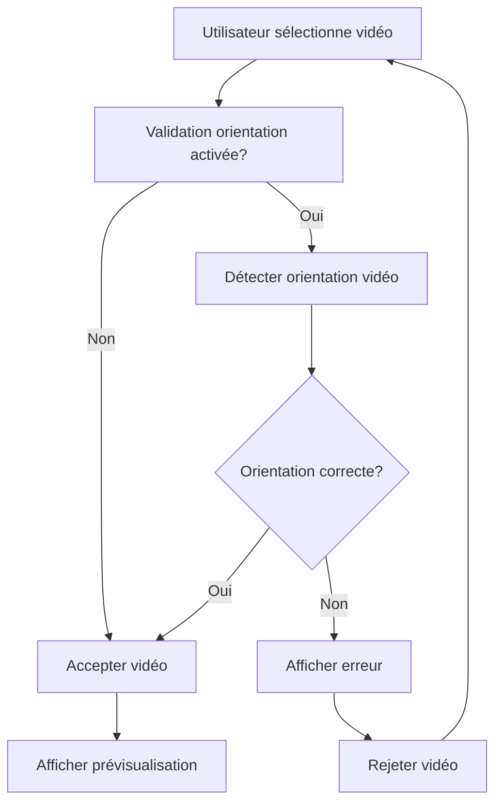

# Validation de l'Orientation Vidéo pour les Completions

## 🎯 Objectif

Lors du processus de completion, valider que l'orientation de la vidéo uploadée par l'utilisateur correspond à l'orientation de la vidéo initiale de la campagne.

## 🔧 Fonctionnement

### Règles de Validation

- **Campagne verticale** → Seules les vidéos verticales sont acceptées
- **Campagne horizontale** → Seules les vidéos horizontales sont acceptées
- **Pas d'orientation définie** → Toutes les orientations sont acceptées

### Détection Automatique

```typescript
// Détection basée sur les métadonnées de la vidéo
const aspectRatio = video.videoWidth / video.videoHeight;
const orientation = aspectRatio > 1 ? 'horizontal' : 'vertical';
```

### Messages d'Erreur

- **Erreur de format** : Message d'erreur rouge avec icône d'avertissement
- **Validation en cours** : Message jaune pendant l'analyse
- **Format accepté** : La vidéo est chargée normalement

## 📍 Implémentation

### Fichiers Modifiés

1. **`lib/utils.ts`** : Fonctions utilitaires
   - `detectVideoOrientation()` : Détecte l'orientation d'un fichier vidéo
   - `validateVideoOrientation()` : Valide l'orientation contre l'attendu

2. **`components/CompletionPopup.tsx`** : Interface de completion
   - Validation lors de l'upload
   - Affichage des messages d'erreur
   - États de validation

### Fonctions Utilitaires

```typescript
// Détecter l'orientation d'une vidéo
export const detectVideoOrientation = (file: File): Promise<'horizontal' | 'vertical'>

// Valider l'orientation contre l'attendu
export const validateVideoOrientation = async (
  file: File, 
  expectedOrientation: 'horizontal' | 'vertical'
): Promise<{ isValid: boolean; detectedOrientation: 'horizontal' | 'vertical' }>
```

## 🎨 Interface Utilisateur

### États d'Affichage

1. **Upload normal** : Bouton d'upload avec indication de l'orientation requise
   - 📱 "Please upload vertical video" pour les campagnes verticales
   - 🖥️ "Please upload horizontal video" pour les campagnes horizontales

2. **Validation en cours** : Message jaune
   - 🔄 "Validation de l'orientation vidéo en cours..."

3. **Erreur de format** : Message rouge avec bordure
   - ⚠️ "Format vidéo incorrect ! Cette campagne requiert une vidéo [orientation], mais vous avez uploadé une vidéo [orientation détectée]. Veuillez uploader une vidéo avec la bonne orientation."

4. **Vidéo acceptée** : Prévisualisation normale de la vidéo

## 🔍 Flux de Validation



## ✅ Avantages

- **Cohérence visuelle** : Maintient l'esthétique de la campagne
- **Expérience utilisateur** : Feedback immédiat et clair
- **Qualité du contenu** : Évite les vidéos mal orientées
- **Automatisation** : Validation automatique sans intervention manuelle

## 🚀 Extension Possible

- Validation des dimensions exactes (résolution)
- Support d'autres formats vidéo
- Validation de la durée vidéo
- Analyse de la qualité vidéo 